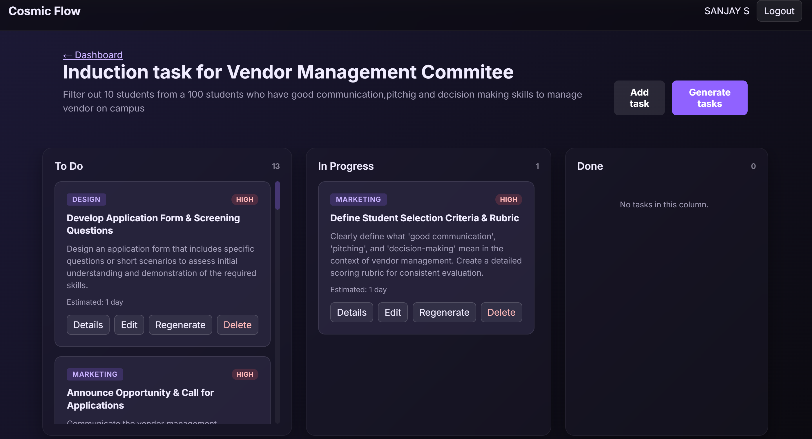
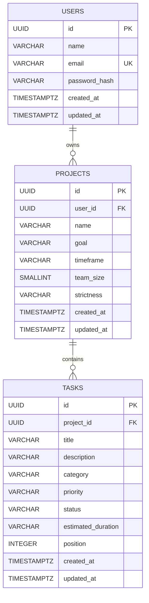

# AI-Powered Task Deconstructor

AI-Powered Task Deconstructor is a multi-user project-planning platform that converts complex goals into actionable, categorized, and prioritized tasks. Each user manages private projects in persistent PostgreSQL-backed Kanban boards, combining AI-assisted planning with practical execution tracking.

## Problem statement

Large goals are difficult to translate into a reliable sequence of manageable actions. Manual planning takes time, varies in quality, and often misses dependencies or realistic estimates, while generic AI responses tend to be unstructured and disconnected from the tools used to execute the work. Users need project planning that is organized, persistent, interactive, and isolated from other users.

## Solution

The application turns a project goal and its planning context into a structured workflow:

- Gemini decomposes the goal into 10–15 actionable task objects.
- Hugging Face zero-shot classification assigns each task a practical category.
- Every task receives a priority, estimated duration, status, and board position.
- PostgreSQL permanently stores user-specific projects and tasks.
- A three-column Kanban board supports execution tracking, editing, regeneration, movement, and reordering.
- Email/password authentication and backend ownership checks isolate each user's data.

## Key features

- Secure email/password registration and login
- Multi-user project and task isolation
- AI generation of 10–15 structured tasks
- Zero-shot classification into five canonical categories
- Priority and estimated-duration planning
- To Do, In Progress, and Done Kanban columns
- Drag-and-drop movement between columns
- Same-column task reordering
- Task editing and deletion
- Individual AI task regeneration
- Dedicated task-detail pages
- Persistent PostgreSQL storage

## Application screenshots


*Secure account access using email/password authentication and HTTP-only cookie sessions.*


*A user-specific dashboard for creating, opening, editing, and deleting projects.*



*Generated tasks organized across To Do, In Progress, and Done columns.*

## How the AI pipeline works

1. A user creates a project with a goal, timeframe, team size, and planning strictness.
2. React sends a project-specific generation request to the Express REST API.
3. The backend authenticates the user, verifies project ownership, and validates the project context.
4. Gemini returns structured task objects using a constrained JSON schema.
5. Hugging Face classifies each task using zero-shot classification.
6. The backend validates and normalizes every task into the canonical schema.
7. All generated tasks are inserted into PostgreSQL inside one transaction.
8. The frontend renders the saved tasks on the Kanban board.

If classification is unavailable or returns malformed data, the backend applies a controlled `Research` fallback instead of failing the complete generation request.

## Architecture

```text
User Browser
    |
    v
React + Vite + React Router
    |
    v
Express REST API
    |
    v
Authentication / Validation / Rate Limiting
    |\
    | +------------------> Gemini API
    | +------------------> Hugging Face API
    v
PostgreSQL
```

- **Browser layer:** Renders routed authentication, dashboard, Kanban, editor, and task-detail interfaces.
- **API layer:** Coordinates REST requests, safe error responses, AI orchestration, and persistence.
- **Security layer:** Verifies HTTP-only JWT sessions, validates input, limits requests, and enforces ownership.
- **Repository layer:** Keeps parameterized SQL and snake_case-to-camelCase mapping outside controllers.
- **Database layer:** Stores normalized users, projects, and ordered tasks with relational constraints.
- **AI layer:** Generates structured work and enriches it with category classification.

## Docker deployment (local)

The repository includes a production-style local Docker Compose stack. The frontend is built once with Vite and served by Nginx; the Vite development server is not used in the container. Nginx serves the React single-page application and proxies same-origin `/api` and `/health` requests to the Express backend. The backend connects to PostgreSQL through Docker's internal `postgres` service name, and calls Gemini and Hugging Face using runtime environment variables.

```text
Browser → frontend (Nginx, localhost:8080) → backend (Express) → PostgreSQL
                                               ├→ Gemini API
                                               └→ Hugging Face API
```

PostgreSQL data is stored in the named `postgres_data` Docker volume, so it persists across container restarts. PostgreSQL has no host port mapping and is reachable only by the containers on the Compose network. A one-time `migrate` service waits for PostgreSQL health, runs the existing idempotent migrations, then allows the backend to start.

Create a local Docker environment file from the safe template, fill in real secrets, then start the stack:

```powershell
Copy-Item .env.docker.example .env.docker
# Edit .env.docker and set POSTGRES_PASSWORD, JWT_SECRET, GEMINI_API_KEY, and HF_API_KEY.
docker compose --env-file .env.docker up --build
```

Open `http://localhost:8080`. The backend is available locally at `http://localhost:3000`, and its health check is also proxied at `http://localhost:8080/health`.

Useful commands:

```powershell
docker compose --env-file .env.docker ps
docker compose --env-file .env.docker logs -f migrate backend frontend
docker compose --env-file .env.docker run --rm migrate
docker compose --env-file .env.docker down
```

`docker compose --env-file .env.docker down` keeps the database volume. To intentionally remove all local database data, run `docker compose --env-file .env.docker down -v`.

The existing non-Docker development workflow remains unchanged: use the root `npm run dev` for Vite and `cd server; npm run dev` for Express with the existing local `.env` files.

## Render deployment

Deploy the frontend as a **Render Static Site**, not as the root Nginx Docker image. The Nginx configuration is intentionally for local Docker Compose, where `backend` is an internal Compose service name. A Render Static Site has no access to that hostname.

Create the backend and Render Postgres database in the same Render region, then create the static site after the backend has a public HTTPS URL.

### Frontend Static Site

| Render setting | Value |
|---|---|
| Service type | Static Site |
| Root directory | Repository root |
| Build command | `npm ci && npm run build` |
| Publish directory | `dist` |
| Environment variable | `SKIP_INSTALL_DEPS=true` |
| Environment variable | `NODE_VERSION=22` |
| Environment variable | `VITE_API_BASE_URL=https://your-backend-name.onrender.com` |

`VITE_API_BASE_URL` is embedded by Vite at build time. Do not include a trailing slash, and redeploy the static site after changing it. In the Static Site **Redirects/Rewrites** settings, add a **Rewrite** rule with source `/*` and destination `/index.html`; this keeps direct React Router navigation and page refreshes working.

### Backend Docker Web Service

| Render setting | Value |
|---|---|
| Service type | Web Service |
| Runtime | Docker |
| Root directory | `server` |
| Dockerfile path | `Dockerfile` |
| Health check path | `/health` |
| Region | Same region as the Render Postgres database |

The Docker image runs the existing idempotent migrations before starting Express. Render provides `PORT`; the server binds to `0.0.0.0` and honors that value.

Set these backend environment variables in Render. Values marked secret must be entered in the Render dashboard and never committed.

| Variable | Value |
|---|---|
| `NODE_ENV` | `production` |
| `TRUST_PROXY` | `true` |
| `DATABASE_URL` | Render Postgres **Internal Database URL** |
| `DATABASE_SSL` | `false` for the internal URL |
| `JWT_SECRET` | A long random secret (secret) |
| `GEMINI_API_KEY` | Gemini credential (secret) |
| `HF_API_KEY` | Hugging Face credential (secret) |
| `CLIENT_ORIGIN` | Exact frontend URL, for example `https://your-frontend-name.onrender.com` |
| `AUTH_COOKIE_SECURE` | `true` |
| `AUTH_COOKIE_SAME_SITE` | `lax` |

`CLIENT_ORIGIN` is the CORS allowlist; use only the deployed frontend URL, without a trailing slash. Render's `*.onrender.com` frontend and backend URLs are HTTPS and same-site, so the existing HTTP-only `SameSite=Lax` cookie works with credentialed API requests. If you later use custom domains, keep the frontend and backend under the same registrable domain (for example, `app.example.com` and `api.example.com`) to preserve this behavior.

The following remain Docker Compose-only: the root frontend Dockerfile, Nginx proxy, service name `backend`, service name `postgres`, local port mappings, and the `postgres_data` Docker volume.

## Technology stack

| Layer | Technology | Purpose |
|---|---|---|
| Frontend | React | Component-based application and state management |
| Frontend | Vite | Development tooling and optimized production builds |
| Frontend | React Router | Public, protected, project, and task-detail routing |
| Backend | Node.js | Server-side JavaScript runtime |
| Backend | Express | REST API, middleware, controllers, and route composition |
| Database | PostgreSQL | Permanent relational storage and transactional consistency |
| Database | `pg` | Connection pooling and raw PostgreSQL queries |
| Database | Raw parameterized SQL | Explicit joins, ownership filters, constraints, and transactions |
| Authentication | `bcryptjs` | Password hashing and verification |
| Authentication | JWT | Signed session identity using a minimal `sub` payload |
| Authentication | HTTP-only cookies | Browser session transport without JavaScript token access |
| AI | Gemini API | Structured goal decomposition and task regeneration |
| AI | Hugging Face zero-shot classification | Task categorization without task-specific model training |
| Testing | Vitest | Frontend unit and integration tests |
| Testing | React Testing Library | User-focused component and routing tests |
| Testing | Node.js test runner | Backend API, service, authorization, and transaction tests |
| Security | CORS, rate limits, validation, ownership checks | Restricts request origins, abuse, malformed input, and cross-user access |
| Security | Parameterized SQL and HTTP-only cookies | Reduces SQL injection and browser-token exposure risks |

## Database design



UUID primary keys identify every record. `projects.user_id` references `users.id`, while `tasks.project_id` references `projects.id`; both relationships use `ON DELETE CASCADE`. Database checks enforce non-empty fields, normalized lowercase email, team-size bounds, canonical category/priority/status values, and non-negative positions.

Indexes support email lookup, user project listing, recently updated projects, project task lookup, and ordered `(project_id, status, position)` board queries. The normalized user → project → task design avoids duplicated ownership data while `position` preserves ordering within each status column.

## API overview

| Area | Method | Route | Purpose |
|---|---|---|---|
| Authentication | `POST` | `/api/auth/register` | Create an account and session |
| Authentication | `POST` | `/api/auth/login` | Authenticate with generic credential errors |
| Authentication | `GET` | `/api/auth/me` | Restore the authenticated user |
| Authentication | `POST` | `/api/auth/logout` | Clear the session cookie |
| Projects | `GET` | `/api/projects` | List the current user's projects |
| Projects | `POST` | `/api/projects` | Create a project |
| Projects | `GET` | `/api/projects/:projectId` | Read an owned project |
| Projects | `PATCH` | `/api/projects/:projectId` | Update an owned project |
| Projects | `DELETE` | `/api/projects/:projectId` | Delete a project and its tasks |
| Tasks | `GET` | `/api/projects/:projectId/tasks` | List ordered project tasks |
| Tasks | `POST` | `/api/projects/:projectId/tasks` | Create a task |
| Tasks | `GET` | `/api/projects/:projectId/tasks/:taskId` | Read a task |
| Tasks | `PATCH` | `/api/projects/:projectId/tasks/:taskId` | Update allowed task fields |
| Tasks | `DELETE` | `/api/projects/:projectId/tasks/:taskId` | Delete a task |
| Tasks | `PATCH` | `/api/projects/:projectId/tasks/reorder` | Persist movement and ordering transactionally |
| AI | `POST` | `/api/projects/:projectId/generate-tasks` | Generate, classify, validate, and save tasks |
| AI | `POST` | `/api/projects/:projectId/tasks/:taskId/regenerate` | Replace mutable task fields with AI output |

## Authentication and authorization

- Passwords are hashed with `bcryptjs`; plain-text passwords and password hashes are never returned.
- JWTs contain only the user identifier in `sub` and are stored in HTTP-only cookies.
- Protected API and frontend routes require an authenticated session.
- Every protected project query combines the requested project ID with the authenticated user ID.
- Every task operation verifies both project ownership and task membership.
- Changing a URL cannot provide access to another user's project or task; inaccessible resources return the same 404 response as nonexistent resources.
- Login uses the same generic error for unknown emails and incorrect passwords, avoiding account-existence disclosure.

## Raw SQL implementation

The backend intentionally uses raw PostgreSQL rather than an ORM. This provides direct control over SQL behavior and demonstrates practical use of:

- `$1`, `$2`, and `$3` parameter placeholders
- Ownership-filtered queries and relational joins
- PostgreSQL connection pooling
- Foreign keys and cascade behavior
- Check constraints and performance-oriented indexes
- Numbered schema migrations and migration tracking
- Transactions with commit and rollback behavior
- Explicit snake_case database to camelCase API mapping

AI-generated tasks are inserted in one PostgreSQL transaction, preventing a partial board if any task fails validation or insertion. Reordering also verifies every task and updates the complete set transactionally.

## Canonical task schema

```json
{
  "id": "uuid",
  "title": "Create application wireframes",
  "description": "Design wireframes for the main user flows.",
  "category": "Design",
  "priority": "High",
  "status": "todo",
  "estimatedDuration": "2 days",
  "position": 0
}
```

**Allowed categories**

- Engineering
- Design
- Marketing
- Research
- Logistics

**Allowed priorities**

- High
- Medium
- Low

**Allowed statuses**

- `todo`
- `in-progress`
- `done`

## Reliability and security

Implemented defense-in-depth measures include:

- Strict request and canonical task validation
- Consistent safe API error structures
- Separate authentication and AI endpoint rate limits
- Explicit credential-aware CORS origins
- Configurable JSON body limits
- Parameterized SQL for all user-provided values
- HTTP-only authentication cookies
- `bcryptjs` password hashing
- Project and task ownership verification
- PostgreSQL check constraints and foreign keys
- Transactional task generation and task reordering
- Hugging Face request timeout and controlled fallback category
- Frontend API timeout and optimistic rollback behavior
- Server-side AI calls that keep provider credentials out of frontend bundles

These protections improve the application's security posture, but they are not a claim of complete production security.


## Important engineering decisions

- **Express was retained instead of migrating to FastAPI:** the existing backend was stable, integrated, and covered by tests, making an ecosystem migration unnecessary for the project's current goals.
- **Raw PostgreSQL was chosen instead of Prisma:** explicit SQL demonstrates query design, joins, transactions, constraints, indexes, migrations, and ownership filtering.
- **HTTP-only cookies were chosen instead of JWTs in `localStorage`:** frontend JavaScript cannot read the authentication token.
- **PostgreSQL replaced browser storage as the source of truth:** projects and tasks persist across browsers and sessions after authentication.
- **AI calls remain server-side:** Gemini and Hugging Face credentials are never shipped to the browser.
- **Provider failures preserve user data:** failed generation or regeneration does not remove existing tasks, and failed optimistic board updates roll back in the UI.

## Challenges solved

- Producing reliable structured output from a general-purpose LLM
- Rejecting empty, malformed, or incomplete AI responses
- Applying zero-shot category classification with a controlled fallback
- Enforcing user-specific authorization at the database boundary
- Inserting multiple AI-generated tasks transactionally
- Persisting cross-column drag-and-drop movement
- Preserving same-column ordering without duplicates or lost tasks
- Rolling back optimistic UI state when persistence fails
- Configuring secure JWT cookie sessions and credential-aware CORS
- Running ordered, idempotent raw SQL migrations
- Transitioning from legacy `localStorage` boards without silently uploading or deleting them

## Project value

This project demonstrates end-to-end full-stack engineering across React interfaces, REST API design, authentication, authorization, PostgreSQL, raw SQL, relational normalization, migrations, and transactional operations. It also shows practical AI orchestration and prompt/schema design, third-party API integration, interactive state management, optimistic updates, automated testing, and security-aware engineering—bringing AI-generated output into a persistent application workflow rather than presenting it as an isolated chatbot response.
